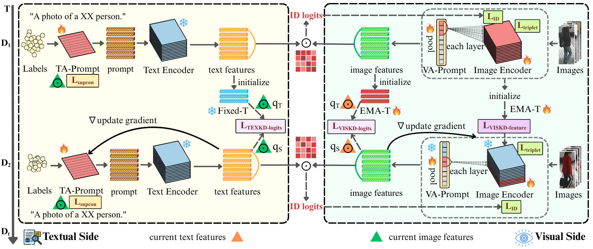

# PAD: Prompt-Anchored Vision–Text Distillation for Lifelong Person Re-identification

Official PyTorch implementation of our CVPR 2026 paper
*Prompt-Anchored Vision–Text Distillation for Lifelong Person Re-identification*.

## Pipeline



## Installation

```bash
conda create -n pad python=3.10 -y
conda activate pad

# CUDA-matched PyTorch from https://pytorch.org/
pip install torch==2.1.0 torchvision==0.16.0

pip install -r requirements.txt
```

The CLIP ViT-B/16 weights (~340 MB) are downloaded automatically on the
first run.

## Prepare datasets

Place the datasets under `data/` using the following layout.

```
data/
├── market1501/{bounding_box_train, query, bounding_box_test}
├── dukemtmcreid/{bounding_box_train, query, bounding_box_test}
├── msmt17/{train, test, list_train.txt, list_val.txt, list_query.txt, list_gallery.txt}
├── cuhksysu/{bounding_box_train, query, bounding_box_test}        # from cuhksysu4reid, renamed to {pid:04d}_c1_{idx:05d}.jpg
├── cuhk03/{bounding_box_train, query, bounding_box_test}          # convert with tools/convert_cuhk03.py
├── LPW_s2/{bounding_box_train, query, bounding_box_test}          # optional (LPW substitution protocol)
└── Unseen/
    ├── cuhk01/campus/*.png
    ├── cuhk02/Dataset/P5/{cam1, cam2}/*.png
    ├── grid/{probe, gallery}/*.jpeg              
    ├── ilids/i-LIDS_Pedestrian/Persons/*.jpg
    ├── prid/single_shot/{cam_a, cam_b}/person_XXXX.png
    ├── sensereid/SenseReID/{test_probe, test_gallery}/*.jpg
    └── viper/VIPeR/{cam_a, cam_b}/*.bmp
```

## Training

Sequentially train all five seen domains (AKA order-1) and evaluate on
every seen domain after each step:

```bash
bash scripts/run_lifelong.sh
```

Resume from a specific domain:

```bash
bash scripts/run_lifelong.sh dukemtmcreid
```

Per-domain invocation:

```bash
# First (anchor) domain: no teacher, full visual-branch tuning.
python train_lifelong.py --domain_idx 0 OUTPUT_DIR Results/market1501

# Subsequent domain: pass the previous-domain checkpoint.
python train_lifelong.py --domain_idx 1 \
    --resume_ckpt Results/market1501/ViT-B-16_stage2.pth \
    OUTPUT_DIR Results/cuhksysu
```

All hyper-parameters live in a single file, `configs/pad.yml`: the
top-level block holds the shared settings and the `DOMAINS` list declares
the per-domain overrides (training sequence follows the list order).
`--domain_idx i` (or `--domain_name NAME`) selects the i-th entry.

## Evaluation

```bash
# Seen domains.
python test_lifelong.py --domain_idx 4 \
    --ckpt Results/cuhk03/ViT-B-16_stage2.pth \
    --eval_domains market1501,cuhksysu,dukemtmcreid,msmt17,cuhk03

# Unseen domains
bash scripts/eval_unseen.sh Results/cuhk03/ViT-B-16_stage2.pth
```

## Acknowledgement

The CLIP backbone and tokenizer under `pad/clip/` are from
[OpenAI CLIP](https://github.com/openai/CLIP). The overall training
pipeline builds on [CLIP-ReID](https://github.com/Syliz517/CLIP-ReID);
the dual-prompt design is inspired by
[DualPrompt](https://github.com/JH-LEE-KR/dualprompt-pytorch).

## Citation

```bibtex
@InProceedings{Wen_2026_CVPR,
    author    = {Wen, Wen and Chen, Hao and Zhang, Shiliang},
    title     = {Prompt-Anchored Vision-Text Distillation for Lifelong Person Re-identification},
    booktitle = {Proceedings of the IEEE/CVF Conference on Computer Vision and Pattern Recognition (CVPR)},
    month     = {June},
    year      = {2026},
    pages     = {18503-18512}
}
```